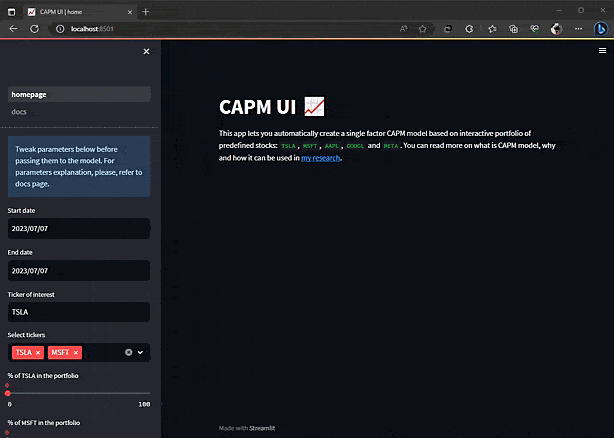

## CAPM_UI
CAPM is a simple yet powerful single-factor model for ROI prediction based on the yeild of some risk-free asset. You can read more on it in [my research](https://github.com/turkunov/CAPM_UI/blob/main/paper.ipynb).

The aim of this repository was to make an interactive CAPM model that can be tuned on the go with Streamlit UI. There's always room for improvement, so I'll be looking forward to any suggestions or bug reports in GH issues!

## Startup process
1) Copy the repository;
2) Install requirements with `pip install -r requirements.txt`;
3) Run the app with `streamlit run homepage.py`

## Demo

